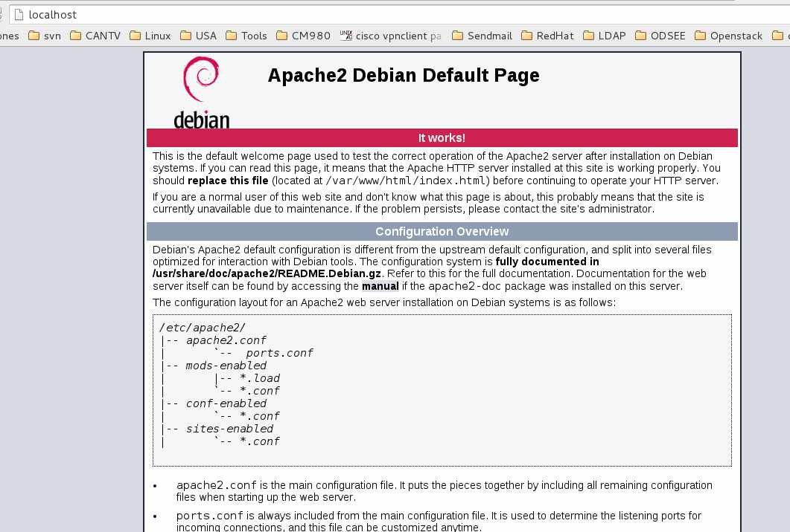
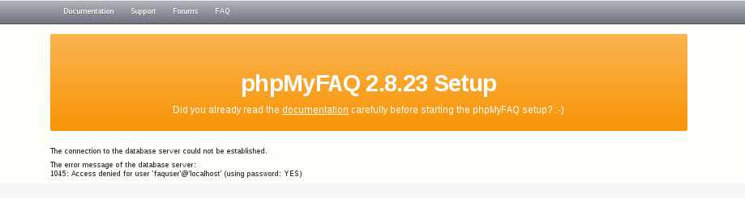
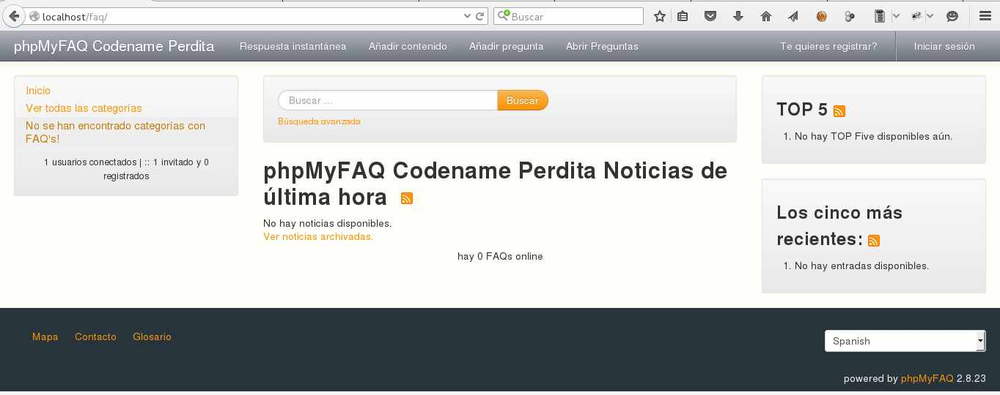
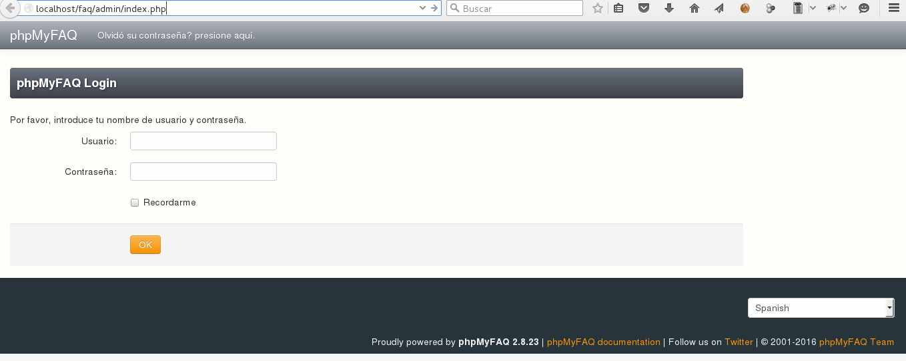

## phpMyfaq - Base de Datos de Conocimientos

### Paso a paso de phpMyfaq en Debian

Se debe instalar LAMP primero, (Linux Apache Mysql Php)
#### Instalamos apache2
```
# apt-get install apache2
```
Para ubicar la IP
```
# ifconfig eth0 | grep inet | awk '{ print $2 }'
```

Probamos la instalación, en un navegador colocamos http://ip-del-servidor y debera ver que apache esta operativo.




#### Instalamos Mysql
```
# apt-get install mysql-server
```

En la instalación de mysql hay un paso que le pide que coloque la contraseña de root para Mysql (no lo olvide).
Cuando culmina la instalación corremos el script.
```
# mysql_secure_installation
```

El script le va pedir la clave del root de Mysql que usted coloco en el paso anterior y siga ahora los pasos.
```
By default, a MySQL installation has an anonymous user, allowing anyone
to log into MySQL without having to have a user account created for them. This is intended only for testing, and to make the installation go a bit smoother. You should remove them before moving into a production environment.
Remove anonymous users? [Y/n] y
... Success!
Normally, root should only be allowed to connect from 'localhost'ensures that someone cannot guess at the root password from
the network.
Disallow root login remotely? [Y/n] y
... Success!
By default, MySQL comes with a database named 'test' that anyone can access. This is also intended only for testing, and should be removed before moving into a production environment.
Remove test database and access to it? [Y/n] y
- Dropping test database...
... Success!
- Removing privileges on test database...
... Success!
Reloading the privilege tables will ensure that all changes made so far will take effect immediately.
Reload privilege tables now? [Y/n] y
... Success!
Cleaning up...
```

#### Instalamos ahora php5
```
# apt-get install php5 php-pear php5-mysql
```

Cuando finalice la instalación reiniciamos el apache
```
# /etc/init.d/apache2 restart
```

Ya con esto tenemos instalado LAMP en debian. Vamos hacer una prueba para certificar que php5 esta integrado con apache2.
```
vi /var/www/html/testphp.php
	<?php
	// Muestra toda la informacion de PHP
	phpinfo();
	// Muestra la informacion de los modulos
	phpinfo(INFO_MODULES);
	?>
```

Ahora en un navegador colocamos http://ip-del-servidor y debe aparecer esto:

#### Ahora si vamos a instalar y configurar phpMyfaq.

Ajustamos la configuración de php5
```
# vi /etc/php5/apache2/php.ini

```
Buscamos y ajustamos los siguientes valores, si las lineas no existe las creamos, en (/etc/php5/apache2/php.ini)

```
[...]
	register_globals = Off
	magic_quotes_gpc = Off
	safe_mode = Off
	memory_limit = 128M
[...]
```

Instalamos las siguientes extensiones de php5
```
# apt-get install php5-mysql php5-common php5-gd php5-xmlrpc
```

reiniciamos el apache
```
# /etc/init.d/apache2 restart
```

Creamos la Base de Datos para phpMyfaq
```
# mysql -u root -p
```

Recuerda que te pide es la contraseña del root de Mysql, continuamos y sigue los siguientes pasos. Cuidado aquí, dale con calma.
```
mysql> create database faqdb DEFAULT CHARACTER SET = 'utf8';
Query OK, 1 row affected (0.00 sec)
mysql> GRANT ALL ON faqdb.* TO faquser@localhost IDENTIFIED BY 'r00tme';
Query OK, 0 rows affected (0.01 sec)
mysql> flush privileges;
Query OK, 0 rows affected (0.01 sec)
mysql> exit
Bye
```

Descargamos phpMyfaq
```
# wget http://download.phpmyfaq.de/phpMyFAQ-2.8.23.zip
```

o lo puedes descardar desde su pagina oficial http://www.phpmyfaq.de/download
Descomprimimos el archivo.
```
# unzip phpmyfaq-2.8.23.zip
# mv phpmyfaq /var/www/faq
# ls /var/www/
# cd /var/www/faq
# mkdir attachments data images
# chmod -R 777 /var/www/html/faq/attachments/
# chmod -R 777 /var/www/html/faq/data/
# chmod -R 777 /var/www/html/faq/images/
# chmod -R 777 /var/www/html/faq/config/
```

#### Instalamos phpMyfaq
Abrimos un navegador y escribimos el siguiente link y completamos los campos, (**recuerde los pasos anteriores, como nombre de la BD, nombre del usuario de la BD y su clave**)recuerda anotarlos y tenerlos por ahi guardados por si tienes que restaurar. 
http://ip-del-servidor/faq/install/setup.php

Complete el cuestionario


Felicitaciones ya instalo phpMyfaq....!!!




Ahora solo queda disfrutarlo. los siguientes link uno es para la administración y el otro para su uso cotidiano.
http://ip-del-servidor/faq




http://ip-del-servidor/faq/admin



**IMPORTANTE**, siempre se debe hacer un respaldo de la base de datos.

### Como hacer respaldo de la base de datos
```
# mysqldump --user=root --password=r00tme faqdb > phpMyfaq.data_dump.SQL
```

### Como restaurar la copia de la base de datos
```
# mysql --user=root --password=r00tme faqdb < phpMyfaq.data_dump.SQL
```
